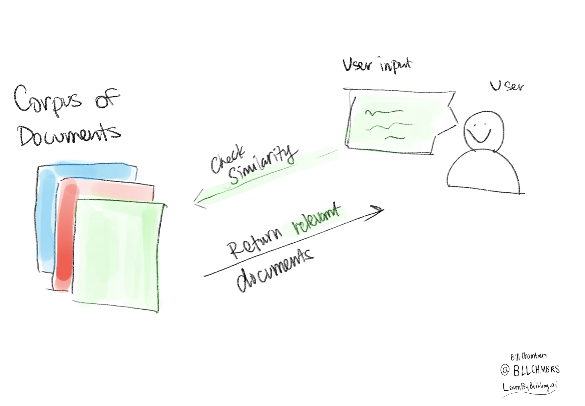

# RAG-from-scratch
## About

## Introduction

> Building a model that researches and contextualizes is more challenging, but it's essential for future advancements. We recently made substantial progress in this realm with our Retrieval Augmented Generation (RAG) architecture, an end-to-end differentiable model that combines an information retrieval component (Facebook AI’s dense-passage retrieval system) with a seq2seq generator (our Bidirectional and Auto-Regressive Transformers BART model). RAG can be fine-tuned on knowledge-intensive downstream tasks to achieve state-of-the-art results compared with even the largest pretrained seq2seq language models. And unlike these pretrained models, RAG’s internal knowledge can be easily altered or even supplemented on the fly, enabling researchers and engineers to control what RAG knows and doesn’t know without wasting time or compute power retraining the entire model.

In short, we can state that the essence of RAG involves adding your own data (via a retrieval tool) to the prompt that you pass into a large language model. As a result, you get an output. That gives you several benefits:

1. You can include facts in the prompt to help the LLM avoid hallucinations
2. You can (manually) refer to sources of truth when responding to a user query, helping to double check any potential issues.
3. You can leverage data that the LLM might not have been trained on.

## Components

1. a collection of documents (formally called a corpus)
2. An input from the user
3. a similarity measure between the collection of documents and the user input

## RAG System FLow

1. Receive a user input
2. Perform our similarity measure
3. Post-process the user input and the fetched document(s).

The post-processing is done with an LLM.

## Large Language Model

we're going to use ollama to get up and running with an open source LLM on our local machine.

Installation instructions are mentioned in references.

## Repository Files

1. poc.py deals only in the retrieval portion of the RAG.
2. rag_from_scratch.py includes the llm powered solution.

### Instructions for  running rag_scratcch.py

an important step is to make sure that ollama's running already on your local machine by running `ollama serve`.

`ollama run llama3.1`

## Environment Setup

1. `python3 -m venv ./rag_env`
2. `source ./rag_env/bin/activate`
3. `pip install -r requirements.txt`

## References

1. [A beginner's guide to building a Retrieval Augmented Generation (RAG) application from scratch](https://learnbybuilding.ai/tutorials/rag-from-scratch)

2. [Retrieval Augmented Generation: Streamlining the creation of intelligent natural language processing models](https://ai.meta.com/blog/retrieval-augmented-generation-streamlining-the-creation-of-intelligent-natural-language-processing-models/)

3. [Retrieval-Augmented Generation for Knowledge-Intensive NLP Tasks](https://arxiv.org/abs/2005.11401)

4. [Jaccard Similarity](https://en.wikipedia.org/wiki/Jaccard_index)

5. [ollama installation instructions](https://ollama.com/)

6. [Llama 3.2](https://www.llama.com/)